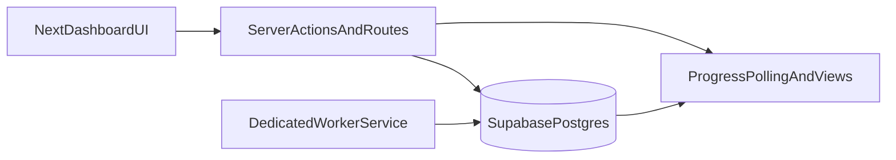

# Production Import Execution Engine Plan

## Guardrails (Do Not Regress)
- Keep current staging path untouched (`uploaded -> staged`), including auth/session propagation and RLS behavior.
- Preserve existing job/row writes and history surfaces while adding async worker execution on top.
- Keep UI client-side authorization unchanged; all mutating execution controls remain server-mediated.

## Target Runtime Architecture

## Phase 1: DB State Machine + Execution Telemetry
- Add migration(s) to extend import execution metadata and normalize lifecycle transitions.
- Introduce new tables for worker-safe chunking and observability:
  - `import_job_chunks` (job_id, chunk_index, worker_id, claimed_at, started_at, completed_at, rows_claimed, rows_imported, rows_failed, retry_count, error_summary).
  - `import_row_attempts` (job_id, row_id, chunk_id, worker_id, attempt_no, started_at, completed_at, status, error_message, dev_stack, payload_snapshot).
- Add indexes for queue pickup, heartbeat scans, and chunk history retrieval.
- Add/extend RPCs for:
  - job dequeue/lease (`FOR UPDATE SKIP LOCKED` semantics)
  - chunk claim/ack/retry
  - stale worker reclaim
  - terminalization (`completed` / `failed` / `partial_success` / `cancelled` / `retrying`).
- Keep existing `import_jobs`/`import_rows` status columns active; bridge new chunk tables through triggers/RPC updates (no breaking rename).

Primary schema files:
- [supabase/migrations/0013_import_processing_queue.sql](supabase/migrations/0013_import_processing_queue.sql)
- [supabase/migrations/0014_auth_context_debug.sql](supabase/migrations/0014_auth_context_debug.sql)
- New migration(s) `0015+` for chunk/attempt tables and RPCs.

## Phase 2: Extract Execution Core (Reusable by Worker + Existing Actions)
- Refactor execution monolith into modules:
  - `queueManager` (job pickup, lease heartbeat, status transitions)
  - `chunkProcessor` (claim chunk, execute rows, commit chunk telemetry)
  - `rowProcessor` (normalize/map/validate/media/hashtags/scheduling/dedupe + safe error capture)
  - `retryManager` (failed chunks/rows only; bounded retries; dead-letter classification)
  - `progressTracker` (rows/sec, ETA, chunk counters, heartbeat freshness)
- Keep current action entrypoint as compatibility wrapper around extracted core for manual operations.

Primary backend refactor targets:
- [src/features/imports/server/executeImportJobChunk.ts](src/features/imports/server/executeImportJobChunk.ts)
- [src/features/imports/server/importJobProgress.ts](src/features/imports/server/importJobProgress.ts)
- [src/features/imports/server/importJobLifecycleActions.ts](src/features/imports/server/importJobLifecycleActions.ts)
- [src/features/imports/server/importQueueAdminActions.ts](src/features/imports/server/importQueueAdminActions.ts)
- [src/features/imports/types.ts](src/features/imports/types.ts)

## Phase 3: Dedicated Worker Service
- Add a dedicated worker process in-repo (service-role runtime only on server/worker side):
  - startup loop: dequeue job -> claim chunk -> process chunk -> heartbeat -> finalize/requeue
  - exponential backoff when queue empty
  - graceful shutdown with lease release
  - worker_id attribution persisted to chunk/attempt/job telemetry
- Add minimal worker config surface:
  - chunk size (default 75; configurable 50-100)
  - max concurrent workers
  - stale heartbeat timeout
  - retry caps (chunk + row)
- Keep UI and server actions authoritative for user-triggered controls (cancel/retry/resume).

Proposed files:
- `worker/importWorker.ts`
- `worker/runtime/workerConfig.ts`
- `worker/runtime/workerLoop.ts`
- `src/features/imports/server/execution/*` (shared core imported by both worker and server actions)

## Phase 4: Progress API + History Evolution
- Extend progress API payload with operational metrics:
  - chunk counters, rows/sec, ETA, last chunk duration, worker_id, heartbeat age, retry history summary.
- Add paged/expandable chunk history endpoint and downloadable error report endpoint.
- Preserve existing responses as backward-compatible fields while adding richer fields.

Primary API/action targets:
- [src/app/actions/importJobsActions.ts](src/app/actions/importJobsActions.ts)
- [src/features/imports/server/importJobProgress.ts](src/features/imports/server/importJobProgress.ts)
- [src/features/imports/server/importFailureDiagnostics.ts](src/features/imports/server/importFailureDiagnostics.ts)
- [src/features/imports/server/importOperationsService.ts](src/features/imports/server/importOperationsService.ts)

## Phase 5: UI Monitoring Upgrades (No Staging Regression)
- Upgrade console and detail views to show:
  - chunk timeline (expandable)
  - retry history and worker status
  - stronger ETA/throughput display sourced from server metrics
  - recovery controls (`resume`, `retry failed rows`, `retry failed chunks`, `cancel`) with clear state transitions.
- Keep dev diagnostics collapsible and hidden by default.
- Maintain overflow-safe, no-horizontal-scroll layout and sticky operational summary.

Primary UI targets:
- [src/features/imports/components/operations-console/ImportOperationsConsole.tsx](src/features/imports/components/operations-console/ImportOperationsConsole.tsx)
- [src/features/imports/components/operations-console/ImportLiveQueuePanel.tsx](src/features/imports/components/operations-console/ImportLiveQueuePanel.tsx)
- [src/features/imports/components/operations-console/ImportHistoryTable.tsx](src/features/imports/components/operations-console/ImportHistoryTable.tsx)
- [src/features/imports/operations/ImportJobDetailClient.tsx](src/features/imports/operations/ImportJobDetailClient.tsx)
- [src/features/imports/hooks/useImportJobProgressPoll.ts](src/features/imports/hooks/useImportJobProgressPoll.ts)

## Phase 6: Security + Reliability Validation
- Verify RLS remains enforced for user-facing paths; worker uses server-only credentials with no client leakage.
- Add transition/invariant tests for lifecycle and retries.
- Add integration tests for stale worker reclaim and resumability.
- Add structured logs (phase/job_id/chunk_id/worker_id/timing/rows/failures) and dashboards-ready counters.

Validation checklist:
- staging still succeeds (import_jobs + import_rows)
- queued jobs execute asynchronously without manual chunk clicks
- no duplicate row processing under concurrency
- stale worker recovery reclaims work safely
- partial failures remain isolated and retryable
- UI reflects real-time status without regressions